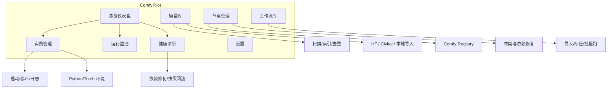
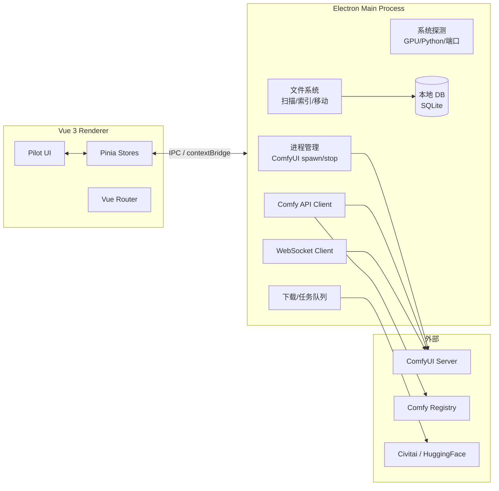

# ComfyPilot — ComfyUI 全能管理器 · 产品与技术方案

> 版本：v0.1 Draft  
> 日期：2026-10-06  
> 技术栈：TypeScript + Vue 3 + Electron（跨平台桌面）  
> 定位：**不替代 ComfyUI 工作台，而是做它的「控制塔」**

---

## 1. 背景与调研结论

### 1.1 ComfyUI 现状（截至 2026-10）

| 维度 | 现状 |
|------|------|
| 仓库 | `Comfy-Org/ComfyUI`，★ 136k+，GPL-3.0，Python |
| 产品形态 | Core / Desktop / Frontend 三仓发布；官方 Desktop App（Windows/macOS）、Portable、Cloud |
| 能力面 | 节点图工作流；图像/视频/音频/3D/文本；子图、模板、App Mode、本地 API |
| 模型生态 | SD1.5/SDXL/SD3.5、Flux、Wan、Hunyuan、Qwen-Image、LTX、Cosmos 等；checkpoint/LoRA/ControlNet/VAE/TE 等分文件加载 |
| 节点生态 | 自定义节点 + **Comfy Registry**（`registry.comfy.org`）+ ComfyUI-Manager v4（pip 安装，`--enable-manager`） |
| 硬件 | NVIDIA / AMD / Intel / Apple Silicon / Ascend / Cambricon / Iluvatar |
| 运行时 | Python 3.13 最稳（3.14 可用但自定义节点有风险），PyTorch ≥ 2.7，推荐 cu130+ |
| 关键机制 | 异步队列、部分图重算、权重流式、VRAM 管理、`extra_model_paths.yaml` 多路径、工作流 JSON/PNG 内嵌 |

### 1.2 生态竞品与空位

```text
┌─────────────────────────────────────────────────────────────┐
│  用户痛点                      现有方案              缺口    │
├─────────────────────────────────────────────────────────────┤
│  画图/搭工作流                 ComfyUI Frontend      已覆盖  │
│  装/卸/更自定义节点            Manager v4            碎、浅  │
│  装 Python/Torch/启动实例      Comfy Desktop/cli     单实例  │
│  模型库（下载/整理/去重）      无统一产品            ★ 空位  │
│  多实例/多环境切换             无                    ★ 空位  │
│  健康诊断/依赖修复/冲突排查    Manager 有碎片能力    ★ 空位  │
│  GPU/队列/性能总览             碎片在 Web 里         ★ 空位  │
│  工作流资产库                  本地散落 JSON         ★ 空位  │
└─────────────────────────────────────────────────────────────┘
```

**结论：** ComfyUI-Manager 管「节点」，Comfy Desktop 管「安装与跑起来」。  
**ComfyPilot 管「整套 ComfyUI 生产资产与运行状态」**——实例、环境、模型、节点、工作流、监控、诊断，一站式控制塔。

---

## 2. 产品定位

### 2.1 一句话

> **ComfyPilot = 本机 ComfyUI 生产线的全能管理台**  
> 让用户在一个桌面应用里：发现/启动实例、管理环境、管模型库、管节点、管工作流、看监控、修问题。

### 2.2 目标用户

| 用户 | 诉求 | 优先级 |
|------|------|--------|
| A. 重度创作者 | 多实例、多模型库、快速换环境 | P0 |
| B. 节点/模型囤积党 | 海量模型与节点，整理、去重、检索 | P0 |
| C. 整合包/工作室运维 | 批量部署、健康检查、备份回滚 | P1 |
| D. 插件/工作流作者 | 版本对照、冲突诊断、工作流打包 | P2 |

### 2.3 设计原则

1. **控制塔，不是编辑器** —— 不重做节点画布，一键跳转官方 Frontend。
2. **读系统真相** —— 直接扫磁盘/进程/Python 环境，不猜。
3. **危险操作可回滚** —— 节点安装、模型删除、环境变更均有快照。
4. **离线可用** —— 本地能力不依赖外网；在线能力（Registry/HF/Civitai）可降级。
5. **不劫持用户环境** —— 旁路管理，不强制重装已有 ComfyUI。

---

## 3. 功能蓝图

### 3.1 模块总览



### 3.2 P0 功能详述

#### A. 实例管理（Instance Hub）
- **发现**：扫描常见路径（Desktop 安装、Portable、git clone、自定义路径、`extra_model_paths.yaml`）
- **识别**：Core 版本、Frontend 版本、Python/Torch/CUDA、监听端口、Manager 是否启用
- **生命周期**：启动 / 停止 / 重启 / 强杀（带确认）；启动参数模板（`--listen`、`--port`、`--preview-method`、`--enable-manager`…）
- **多实例**：并行启动，端口冲突检测与自动分配
- **日志**：实时 tail、错误高亮、一键复制诊断包

#### B. 模型库（Model Library）
- **扫描索引**：checkpoint / lora / vae / clip / controlnet / upsampler / embeddings / unet / diffusion_models
- **多路径**：读取 `extra_model_paths.yaml` + 自定义搜索根
- **元数据**：safetensors header、Civitai 元数据、缩略图、文件大小、哈希去重
- **检索**：全文 + 标签 + 架构（SDXL/Flux/Wan…）+ 来源
- **下载**：HuggingFace / Civitai 链接解析、断点续传、aria2 可选
- **整理**：移动/软链、批量改名、占用分析（「谁吃了 2TB」）

#### C. 节点管理（Node Packs）
- **数据源**：Comfy Registry API + Manager channel 列表 + 本地 `custom_nodes` 扫描
- **操作**：安装 / 更新 / 启用 / 禁用 / 卸载 / 锁定版本
- **健康**：requirements 冲突、Python 版本不兼容、与其它 pack 的节点名冲突、import 失败
- **快照**：安装前自动快照，一键回滚
- **注意**：尊重 Manager 的 security_level 语义；危险操作二次确认

#### D. 运行监控（Live）
- 进程存活、端口、启动时长
- GPU：利用率 / 显存 / 温度 / 功耗（`systeminformation` + 各平台后端）
- 队列：pending / running / done，进度与预览图
- WebSocket 接 ComfyUI（`/ws`）拿 progress、executing、executed
- 历史记录与产物文件索引

#### E. 健康诊断（Doctor）
一键体检清单：
1. Python 版本 / venv 可用性  
2. torch 与 CUDA/ROCm/MPS 匹配  
3. ComfyUI 启动参数与端口占用  
4. custom_nodes import 冒烟测试（受控子进程）  
5. `extra_model_paths.yaml` 路径有效性  
6. 磁盘空间（models / output）  
7. Manager / Registry 连通性  
输出：问题分级（红/黄/绿）+ 修复建议 + 一键修复（可自动的项）

### 3.3 P1 / P2

| 优先级 | 功能 |
|--------|------|
| P1 | 工作流库（JSON/PNG 解析、标签、版本、一键排队） |
| P1 | 备份与恢复（配置、节点、模型清单，不备份大模型本体） |
| P1 | 环境隔离助手（venv/uv 创建、按实例绑 torch 版本） |
| P2 | 批量出图任务面板（读 API `/prompt`，多工作流批跑） |
| P2 | 产物库（output 索引、EXIF/PNG info 还原参数） |
| P2 | 远程实例（SSH/局域网 API）管理 |
| P2 | 插件市场风格 UI + 评分/评论（仅本地/私有 channel） |

---

## 4. 信息架构（页面）

```text
ComfyPilot
├── 总览 Dashboard          实例状态卡片 / GPU 卡 / 最近任务 / 告警
├── 实例 Instances
│   ├── 实例列表
│   ├── 实例详情（概览 / 启动配置 / 日志 / 环境）
│   └── 新建/导入实例向导
├── 模型 Models
│   ├── 全部模型（表格+网格）
│   ├── 按类型/架构
│   ├── 下载任务
│   └── 存储分析
├── 节点 Node Packs
│   ├── 已安装
│   ├── 浏览 Registry / Channel
│   └── 冲突与依赖
├── 工作流 Workflows
├── 监控 Monitor            实时 / 历史
├── 诊断 Doctor
└── 设置 Settings           路径 / 网络代理 / 外观 / 关于
```

---

## 5. 技术架构

### 5.1 总体架构



### 5.2 进程与 IPC 边界

| 层 | 职责 | 禁止 |
|----|------|------|
| Main | spawn 进程、读写盘、系统探测、下载、DB | 渲染 UI |
| Preload | `contextBridge` 暴露白名单 API | 暴露 `require`/`ipcRenderer` 原始对象 |
| Renderer | 交互、状态、图表 | 直接 `fs`/`child_process` |

**IPC 设计原则**：按域拆分 channel（`instance.*` / `model.*` / `node.*` / `monitor.*` / `doctor.*`），请求-响应用 `invoke`，流式（日志/进度）用 `webContents.send`。

### 5.3 与 ComfyUI 集成面

| 能力 | 途径 |
|------|------|
| 版本/节点信息 | 读安装目录、`python -c` 探测、Manager 端点 |
| 启停 | Main 直接 spawn（记录 PID、stdout/stderr） |
| 队列/历史 | `GET /queue` `/history` `/system_stats` |
| 提交工作流 | `POST /prompt` |
| 实时进度 | `WS /ws`（clientId） |
| 对象定义 | `GET /object_info` |
| 节点安装 | 优先 Manager/`cm-cli` 语义或 Registry API；避免平行黑盒 |

### 5.4 数据存储

- **SQLite**（`better-sqlite3`）：模型索引、节点索引、工作流库、任务历史、诊断记录
- **JSON 配置**：用户设置、实例注册表（可导出）
- **大文件不进库**：模型只存路径+元数据；缩略图存 `userData/cache`

---

## 6. 技术选型

| 类别 | 选型 | 理由 |
|------|------|------|
| 构建 | **electron-vite** + electron-builder | TS/Vue 官方友好、多端打包成熟 |
| 语言 | TypeScript 5（strict） | 全栈类型 |
| 框架 | Vue 3.5 + `<script setup>` + Pinia + Vue Router | 题目指定，生态完善 |
| UI | **Naive UI**（主）+ ECharts | 中文友好、组件全、主题变量好改；表格/表单密集型界面匹配 |
| 样式 | UnoCSS 或 Tailwind + CSS 变量 | 快速出密度型后台 UI |
| DB | better-sqlite3 | 同步、快、桌面场景足够 |
| 系统信息 | systeminformation + 自研 GPU 适配层 | 跨 Win/mac/Linux |
| 进程 | Node `child_process` + 可选 `node-pty` | 日志与控制 |
| HTTP/WS | undici + ws | 稳、无 axios 包袱 |
| 下载 | 自研任务队列（支持断点）+ 可选 aria2 | 模型文件大，必须可控 |
| 测试 | Vitest（unit）+ Playwright（e2e 冒烟） | |
| 规范 | ESLint + Prettier + vue-tsc | CI 强制 |

### 为什么不选……

- **Electron + React**：题目指定 Vue3；且中文后台组件 Vue 生态够用。  
- **Tauri**：体积更小，但 Python 子进程/GPU 探测/打包签名在 Windows 上坑多，一期不冒险。  
- **自己重写节点编辑器**：与官方 Frontend 正面冲突，无胜算。

---

## 7. 项目结构（建议）

```text
ComfyPilot/
├── package.json
├── electron.vite.config.ts
├── electron-builder.yml
├── src/
│   ├── main/                    # Electron 主进程
│   │   ├── index.ts
│   │   ├── ipc/                 # ipc handlers 按域拆分
│   │   ├── services/
│   │   │   ├── instance/        # 发现、启动、停止
│   │   │   ├── model/           # 扫描、索引、下载
│   │   │   ├── nodePack/        # Registry、安装、冲突
│   │   │   ├── comfyApi/        # HTTP + WS
│   │   │   ├── doctor/          # 体检与修复
│   │   │   └── system/          # GPU / Python / 端口
│   │   └── db/
│   ├── preload/
│   │   └── index.ts
│   └── renderer/
│       ├── index.html
│       ├── src/
│       │   ├── main.ts
│       │   ├── App.vue
│       │   ├── router/
│       │   ├── stores/          # Pinia
│       │   ├── views/           # 按 IA 分目录
│       │   ├── components/
│       │   ├── composables/
│       │   └── styles/
├── resources/                   # 图标、脚本
└── tests/
```

---

## 8. 关键设计决策

| 决策 | 选择 | 说明 |
|------|------|------|
| 是否内置 Frontend | **否，外链/内嵌 BrowserView 可选** | 一期用「在浏览器打开」；二期可 WebContentsView 嵌入 |
| 是否自带 Python | **默认不带** | 探测用户已有环境；提供「创建独立 venv」高级向导 |
| 节点安装源 | **Registry 优先，Manager 兼容** | 避免和 Manager 快照/安全模型打架 |
| 模型是否改用户目录 | **默认只读索引**；移动/删除需显式操作 | 防止误伤 |
| 自动更新 | electron-updater（应用自身） | 不自动更 ComfyUI |
| 多语言 | i18n（zh-CN 默认，en-US） | |

---

## 9. 里程碑

| 阶段 | 周期（估） | 交付 |
|------|------------|------|
| **M0 脚手架** | 1 周 | electron-vite 工程、IPC 骨架、主题、路由、CI |
| **M1 实例 MVP** | 2 周 | 扫描实例、启动/停止、日志、状态、设置路径 |
| **M2 模型库** | 2–3 周 | 扫描索引、检索、存储分析、下载任务 |
| **M3 节点管理** | 2–3 周 | Registry 列表、安装/更新/禁用、冲突检测、快照 |
| **M4 监控+诊断** | 2 周 | GPU/队列实时、Doctor 体检报告 |
| **M5 打磨发布** | 2 周 | 工作流库基础、i18n、打包 Win/mac/Linux、文档 |
| **v1.0** | 约 3 个月 | 公开发布 |

---

## 10. 风险与边界

| 风险 | 缓解 |
|------|------|
| ComfyUI 自身迭代极快（周更） | 对 API 做版本探测与能力协商；核心逻辑与 UI 解耦 |
| Manager 安全策略与回滚语义复杂 | 复用其配置模型，不另起炉灶写「暗装」 |
| 用户环境千奇百怪（Portable/conda/uv/系统 Python） | 探测优先，向导兜底；诊断而不是强改 |
| 大模型文件操作风险 | 默认只读；危险操作白屏确认 + 可撤销 |
| GPU 驱动/ROCm 差异 | 只读探测，不负责装驱动；给出官方文档链接 |
| GPL-3.0（ComfyUI） | ComfyPilot 独立应用，通过 HTTP/进程边界交互，不静态链接其代码；自选开源协议建议 MIT/AGPL 二选一再定 |

---

## 11. 一期 UI 风格方向（视觉基调）— 亮色现代

- **风格锚点**：Linear / Raycast 式高密度专业工具台 + 浅色玻璃拟态仪表盘  
- **色板**：底 `#F2F6FC`、面 `#FFFFFF`、墨 `#0F172A`、弱 `#94A3B8`、主渐变 `#4F6EF7 → #7C5CFC → #22D3EE`（成功 `#10B981` / 警告 `#F59E0B` / 错误 `#EF4444`）  
- **字体**：Latin `Inter` + CJK `PingFang SC` / `Microsoft YaHei`；代码 `JetBrains Mono`  
- **布局**：左侧 240px 玻璃导航 + 顶部 64px 工具条 + 卡片圆角 20px + 柔和阴影  
- **记忆点**：① 总览页「生产线状态」渐变卡片；② 诊断页一键体检/一键修复  
- **明确不做**：深色 / 暗黑主题

---

## 12. 已确认决策（2026-10-06）

1. **范围**：六大模块全做（总览/实例/模型/节点/工作流/监控/诊断/设置/内嵌）
2. **UI**：Naive UI + **亮色现代酷炫风**（明确不做深色/暗黑主题）
3. **Frontend**：WebContentsView **内嵌** + 支持**外链浏览器**
4. **开源**：GitHub 项目，**MIT** 协议，完整工程结构

## 13. 当前进度（全量实施完成）

### P0 — 全部实现
- [x] 实例：发现/启停/重启/强杀/端口检测与建议/参数模板/环境探测/诊断包
- [x] 模型：extra_model_paths.yaml、safetensors 元数据、SHA256 去重、断点下载、移动/软链/标签、存储分析
- [x] 节点：Registry 搜索安装、更新、锁定、冲突检测、冒烟测试、快照回滚、Manager security 语义
- [x] 监控：系统/GPU、队列历史、WebSocket `/ws` 实时进度
- [x] 诊断：全项体检 + 一键修复（create-models-dir / create-custom-nodes 等）

### P1 / P2 — 全部实现
- [x] 工作流：JSON/PNG 解析、标签、seed 还原、一键排队
- [x] 备份与恢复（配置/实例/节点清单/模型清单/工作流）
- [x] 环境隔离（venv/uv 创建、torch 安装、多 Python 探测）
- [x] 批量出图任务面板
- [x] 产物库（output 索引、PNG 参数还原）
- [x] 远程实例管理
- [x] 插件市场 UI

### 工程
- [x] SQLite（better-sqlite3）持久化
- [x] 全量 IPC channel + Preload 白名单
- [x] 亮色现代 UI（无暗色主题）
- [x] 内嵌 Frontend + 外链
- [x] MIT / README / electron-builder
- [x] 类型检查与构建通过
